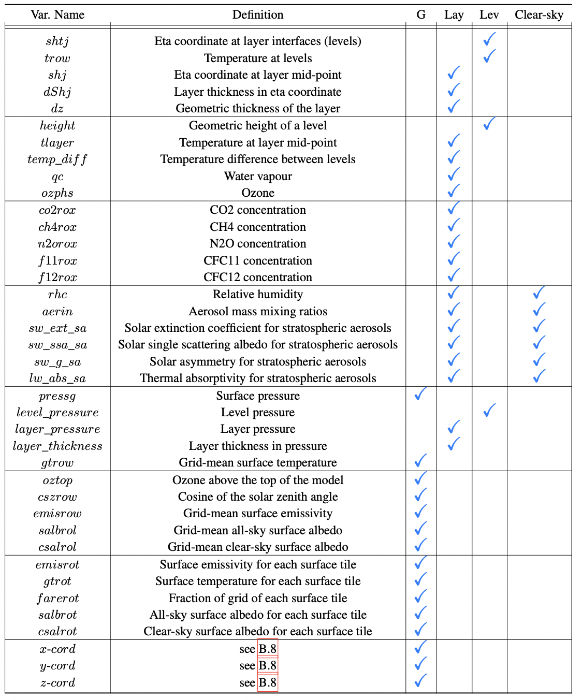

# ***ClimART*** - A Benchmark Dataset for Emulating Atmospheric Radiative Transfer in Weather and Climate Models
<a href="https://pytorch.org/get-started/locally/"></a>
<a href="https://pytorch.org/get-started/locally/"></a>
![CC BY 4.0][cc-by-image]

[cc-by-image]: https://i.creativecommons.org/l/by/4.0/88x31.png
[cc-by-shield]: https://img.shields.io/badge/License-CC%20BY%204.0-lightgrey.svg

## Research-code PyTorch Implementation

### Using deep learning to optimise radiative transfer calculations.

Our NeurIPS 2021 Datasets Track paper: https://arxiv.org/abs/2111.14671

Abstract:   *Numerical simulations of Earth's weather and climate require substantial amounts of computation. This has led to a growing interest in replacing subroutines that explicitly compute physical processes with approximate machine learning (ML) methods that are fast at inference time. Within weather and climate models, atmospheric radiative transfer (RT) calculations are especially expensive.  This has made them a popular target for neural network-based emulators. However, prior work is hard to compare due to the lack of a comprehensive dataset and standardized best practices for ML benchmarking. To fill this gap, we build a large dataset, ClimART, with more than **10 million** samples from present, pre-industrial, and future climate conditions, based on the Canadian Earth System Model.
ClimART poses several methodological challenges for the ML community, such as multiple out-of-distribution test sets, underlying domain physics, and a trade-off between accuracy and inference speed. We also present several novel baselines that indicate shortcomings of datasets and network architectures used in prior work.*

Contact: Venkatesh Ramesh [(venka97 at gmail)](mailto:venka97@gmail.com) or Salva Rühling Cachay [(salvaruehling at gmail)](mailto:salvaruehling@gmail.com). <br>

## Overview:

* ``climart/``: Package with the main code, baselines and ML training logic.
* ``notebooks/``: Notebooks for visualization of data.
* ``analysis/``: Scripts to create visualization of the results (requires logging).
* ``scripts/``: Scripts to train and evaluate models, and to download the whole ClimART dataset.

## Getting Started
<details><p>
    <summary><b> Requirements</b></summary>
    <p style="padding: 10px; border: 2px solid red;">
    <ul>
    <li>Linux and Windows are supported, but we recommend Linux for performance and compatibility reasons.</li>
    <li>NVIDIA GPUs with at least 8 GB of memory and system with 12 GB RAM (More RAM is required if training with --load_train_into_mem option which allows for faster training). We have done all testing and development using NVIDIA V100 GPUs.</li> 
    <li>64-bit Python >=3.7 and PyTorch >=1.8.1. See https://pytorch.org/ for PyTorch install instructions.</li> 
    <li>Python libraries mentioned in ``env.yml`` file, see Getting Started (Need to have miniconda/conda installed).</li> 
    </ul></p>
</details>

<details><p>
    <summary><b> Downloading the ClimART Dataset </b></summary>
    <p style="padding: 10px; border: 2px solid red;">
    By default, only a subset of CLimART is downloaded.
    To download the train/val/test years you want, please change the loop in ``data_download.sh.`` appropriately.
    To download the whole ClimART dataset, you can simply run 
    
    bash scripts/download_climart_full.sh 
   </p>
</details>


    conda env create -f env.yml   # create new environment will all dependencies
    conda activate climart  # activate the environment called 'climart'
    bash data_download.sh  # download the dataset (or a subset of it, see above)
    # For one of {CNN, GraphNet, GCN, MLP}, run the model with its lowercase name with the following commmand:
    bash scripts/train_<model-name>.sh


## Dataset Structure

To avoid storage redundancy, we store one single input array for both pristine- and clear-sky conditions. The dimensions of ClimART’s input arrays are:
<ul>
<li>layers: (N, 49, D-lay) </li>
<li>levels: (N, 50, 4) </li>
<li>globals: (N, 82) </li>
</ul>

where N is the data dimension (i.e. the number of examples of a specific year, or, during training, of a batch),
 49 and 50 are the number of layers and levels in a column respectively. Dlay, 4, 82 is the number of features/channels for layers, levels, globals respectively. 

For pristine-sky Dlay = 14, while for clear-sky Dlay = 45, since it contains extra aerosol related variables. The array for pristine-sky conditions can be easily accessed by slicing the first 14 features out of the stored array, e.g.:
```      pristine_array = layers_array[:, :, : 14] ```

The complete list of variables in the dataset is as follows: </br>



## Training Options

```
--exp_type: "pristine" or "clear_sky" for training on the respective atmospheric conditions.
--target_type: "longwave" (thermal) or "shortwave" (solar) for training on the respective radiation type targets.
--target_variable: "Fluxes" or "Heating-rate" for training on profiles of fluxes or heating rates.
--model: ML model architecture to select for training (MLP, GCN, GN, CNN)
--workers: The number of workers to use for dataloading/multi-processing.
--device: "cuda" or "cpu" to use GPUs or not.
--load_train_into_mem: Whether to load the training data into memory (can speed up training)
--load_val_into_mem: Whether to load the validation data into memory (can speed up training)
--lr: The learning rate to use for training.
--epochs: Number of epochs to train the model for.
--optim: The choice of optimizer to use (e.g. Adam)
--scheduler: The learning rate scheduler used for training (expdecay, reducelronplateau, steplr, cosine).
--weight_decay: Weight decay to use for the optimization process.
--batch_size: Batch size for training.
--act: Activation function (e.g. ReLU, GeLU, ...).
--hidden_dims: The hidden dimensionalities to use for the model (e.g. 128 128).
--dropout: Dropout rate to use for parameters.
--loss: Loss function to train the model with (MSE recommended).
--in_normalize: Select how to normalize the data (Z, min_max, None). Z-scaling is recommended.
--net_norm: Normalization scheme to use in the model (batch_norm, layer_norm, instance_norm)
--gradient_clipping: If "norm", the L2-norm of the parameters is clipped the value of --clip. Otherwise no clipping.
--clip: Value to clip the gradient to while training.
--val_metric: Which metric to use for saving the 'best' model based on validation set. Default: "RMSE"
--gap: Use global average pooling in-place of MLP to get output (CNN only).
--learn_edge_structure: If --model=='GCN': Whether to use a L-GCN (if set) with learnable adjacency matrix, or a GCN.
--train_years: The years to select for training the data. (Either individual years 1997+1991 or range 1991-1996)
--validation_years: The years to select for validating the data. Recommended: "2005" or "2005-06" 
--test_ood_1991: Whether to load and test on OOD data from 1991 (Mt. Pinatubo; especially challenging for clear-sky conditions)
--test_ood_historic: Whether to load and test on historic/pre-industrial OOD data from 1850-52.
--test_ood_future: Whether to load and test on future OOD data from 2097-99 (under a changing climate/radiative forcing)
--wandb_model: If "online", Weights&Biases logging. If "disabled" no logging.
--expID: A unique ID for the experiment if using logging.

```

## Reproducing our Baselines

To reproduce our paper results (for seed = 7) you may run the following commands in a shell. 
    
### CNN

```
python main.py --model "CNN" --exp_type "pristine" --target_type "shortwave" --workers 6 --seed 7 \
  --batch_size 128 --lr 2e-4 --optim Adam --weight_decay 1e-6 --scheduler "expdecay" \
  --in_normalize "Z" --net_norm "none" --dropout 0.0 --act "GELU" --epochs 100 \
  --gap --gradient_clipping "norm" --clip 1.0 \
  --train_years "1990+1999+2003" --validation_years "2005" \
  --wandb_mode disabled
```

### MLP 

```
python main.py --model "MLP" --exp_type "pristine" --target_type "shortwave" --workers 6 --seed 7 \
  --batch_size 128 --lr 2e-4 --optim Adam --weight_decay 1e-6 --scheduler "expdecay" \
  --in_normalize "Z" --net_norm "layer_norm" --dropout 0.0 --act "GELU" --epochs 100 \
  --gradient_clipping "norm" --clip 1.0 --hidden_dims 512 256 256 \
  --train_years "1990+1999+2003" --validation_years "2005" \
  --wandb_mode disabled
```

### GCN

```
python main.py --model "GCN+Readout" --exp_type "pristine" --target_type "shortwave" --workers 6 --seed 7 \
  --batch_size 128 --lr 2e-4 --optim Adam --weight_decay 1e-6 --scheduler "expdecay" \
  --in_normalize "Z" --net_norm "layer_norm" --dropout 0.0 --act "GELU" --epochs 100 \
  --preprocessing "mlp_projection" --projector_net_normalization "layer_norm" --graph_pooling "mean"\
  --residual --improved_self_loops \
  --gradient_clipping "norm" --clip 1.0 --hidden_dims 128 128 128 \  
  --train_years "1990+1999+2003" --validation_years "2005" \
  --wandb_mode disabled
```

## Logging

Currently, logging is disabled by default. However, the user may use wandb to log the experiments by passing the argument ``--wandb_mode=online``

## Notebooks

There are some jupyter notebooks in the notebooks folder which we used for plotting, benchmarking etc. You may go through them to visualize the results/benchmark the models.

## License: 
This work is made available under [Attribution 4.0 International (CC BY 4.0)](https://creativecommons.org/licenses/by/4.0/legalcode) license. ![CC BY 4.0][cc-by-shield]

## Development

This repository is currently under active development and you may encounter bugs with some functionality. 
Any feedback, extensions & suggestions are welcome!


## Citation
If you find ClimART or this repository helpful, feel free to cite our publication:

    @inproceedings{cachay2021climart,
        title={{ClimART}: A Benchmark Dataset for Emulating Atmospheric Radiative Transfer in Weather and Climate Models},
        author={Salva R{\"u}hling Cachay and Venkatesh Ramesh and Jason N. S. Cole and Howard Barker and David Rolnick},
        booktitle={Thirty-fifth Conference on Neural Information Processing Systems Datasets and Benchmarks Track},
        year={2021},
        url={https://arxiv.org/abs/2111.14671}
    }